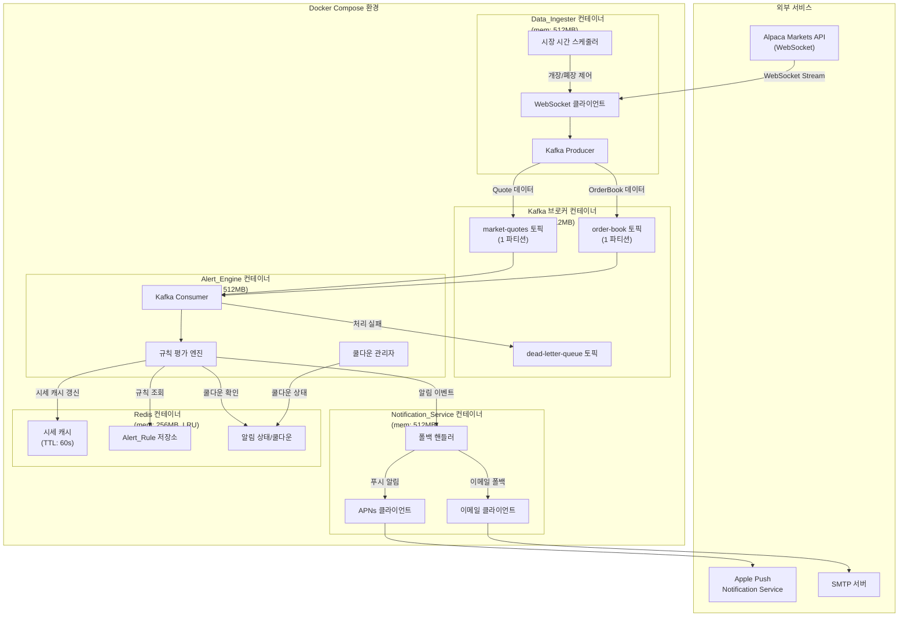
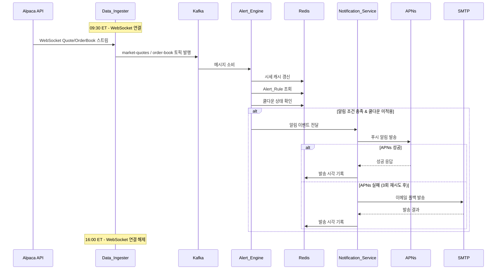
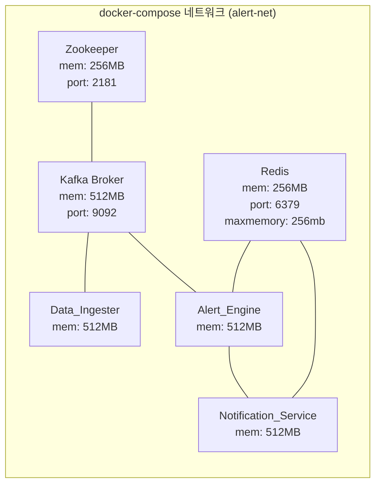
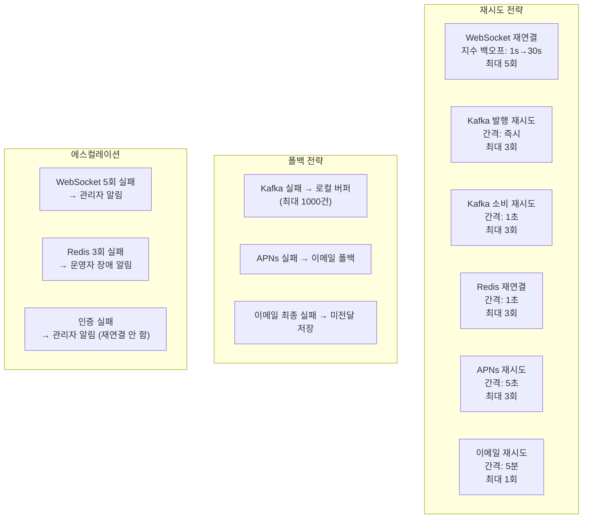
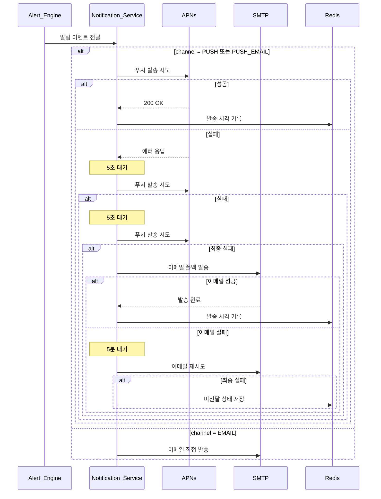

# 설계 문서 (Design Document)

## Overview

본 시스템은 Alpaca Markets API를 통해 실시간 주식 시세(Quote) 및 호가창(Order Book) 데이터를 수신하고, 사용자가 설정한 조건에 따라 iOS 푸시 알림 또는 이메일로 알림을 전달하는 경량 스트리밍 파이프라인이다.

### 핵심 설계 원칙

- **최소 리소스 사용**: 단일 Kafka 브로커, 토픽당 1 파티션, Redis 256MB 제한, 컨테이너당 512MB 메모리 제한
- **WebSocket 전용 수신**: HTTP 폴링 없이 서버 푸시 방식만 사용하여 네트워크 및 CPU 리소스 절약
- **시장 시간 스케줄링**: 개장(09:30 ET) ~ 폐장(16:00 ET) 시간에만 WebSocket 연결 유지
- **알림 우선순위**: iOS 푸시 알림 우선, 실패 시 이메일 폴백
- **Docker Compose 단일 배포**: `docker-compose up` 한 번으로 전체 시스템 기동

### 기술 스택

| 구분 | 기술 | 버전/라이브러리 |
|------|------|----------------|
| 언어 | Python | 3.11+ (asyncio) |
| 메시지 브로커 | Apache Kafka | confluent-kafka 2.x |
| 캐시/상태 저장 | Redis | redis-py 5.x |
| iOS 푸시 | APNs | PyAPNs2 (HTTP/2) |
| 이메일 | SMTP | aiosmtplib |
| 컨테이너 | Docker Compose | v3.8+ |
| 스케줄링 | APScheduler | pytz (US/Eastern) |

---

## Architecture

### 시스템 컴포넌트 다이어그램



### 데이터 흐름 시퀀스 다이어그램



---

## Components and Interfaces

### 1. Data_Ingester

**책임**: Alpaca WebSocket API로부터 실시간 시세/호가 데이터를 수신하여 Kafka로 발행

| 인터페이스 | 설명 |
|-----------|------|
| `connect()` | Alpaca WebSocket 연결 수립 및 종목 구독 |
| `disconnect()` | WebSocket 연결 해제 및 대기 모드 전환 |
| `on_quote(data)` | Quote 데이터 수신 콜백 → Kafka 발행 |
| `on_orderbook(data)` | OrderBook 데이터 수신 콜백 → Kafka 발행 |
| `schedule_market_hours()` | 개장/폐장 시간 기반 연결 스케줄링 |

**설계 결정**:
- `alpaca-py` SDK의 `StockDataStream` 클래스를 사용하여 WebSocket 연결 관리
- asyncio 이벤트 루프에서 단일 스레드로 동작
- 로컬 버퍼(최대 1000건)로 Kafka 장애 시 메시지 보존
- 지수 백오프 재연결: 초기 1초, 최대 30초, 최대 5회

### 2. Kafka_Pipeline

**책임**: 시장 데이터 이벤트의 비동기 전달 및 순서 보장

| 설정 | 값 |
|------|-----|
| 브로커 수 | 1 (단일) |
| `market-quotes` 토픽 | 파티션 1, 복제 팩터 1 |
| `order-book` 토픽 | 파티션 1, 복제 팩터 1 |
| `dead-letter-queue` 토픽 | 파티션 1, 복제 팩터 1 |
| 메시지 보존 기간 | 24시간 |
| 파티션 키 | 종목 심볼 (ticker symbol) |

**설계 결정**:
- 단일 파티션으로 종목별 메시지 순서 보장 (파티션 키 = 심볼)
- `confluent-kafka` 라이브러리 사용 (librdkafka 기반, 고성능)
- Consumer는 `asyncio.to_thread()`로 동기 poll을 비동기 래핑
- 처리 실패 메시지는 dead-letter-queue로 이동 (최대 3회 재시도 후)

### 3. Alert_Engine

**책임**: 수신된 시장 데이터와 사용자 Alert_Rule을 비교하여 알림 이벤트 생성

| 인터페이스 | 설명 |
|-----------|------|
| `consume_quotes()` | market-quotes 토픽 소비 및 가격 알림 평가 |
| `consume_orderbook()` | order-book 토픽 소비 및 호가 변동 평가 |
| `evaluate_price_rules(quote, rules)` | 가격 조건 비교 (목표가/하한가/변동률) |
| `evaluate_orderbook_rules(orderbook, prev)` | 호가 잔량 변동 및 수급 불균형 평가 |
| `check_cooldown(rule_id)` | 중복 알림 억제 (5분/60초 쿨다운) |
| `emit_alert_event(event)` | 알림 이벤트를 Notification_Service로 전달 |

**설계 결정**:
- Redis에서 Alert_Rule을 해시 구조로 조회 (O(1) 접근)
- 쿨다운 상태를 Redis TTL로 관리 (자동 만료)
- 가격 필드 유효성 검증 (누락/0 이하 → 스킵 + 에러 로그)
- 직전 OrderBook 데이터를 메모리에 캐시하여 변동률 산출

### 4. Notification_Service

**책임**: 알림 이벤트를 iOS 푸시 또는 이메일로 발송

| 인터페이스 | 설명 |
|-----------|------|
| `send_notification(event)` | 알림 채널 결정 및 발송 오케스트레이션 |
| `send_push(device_tokens, payload)` | APNs를 통한 iOS 푸시 발송 |
| `send_email(email, payload)` | SMTP를 통한 이메일 발송 |
| `handle_fallback(event)` | 푸시 실패 시 이메일 폴백 처리 |

**설계 결정**:
- PyAPNs2로 HTTP/2 기반 APNs 통신 (토큰 기반 인증)
- 푸시 실패 시 5초 간격 최대 3회 재시도 → 이메일 폴백
- aiosmtplib으로 비동기 이메일 발송
- 무효 디바이스 토큰 자동 비활성화

### 5. Redis_Store

**책임**: 시세 캐시, Alert_Rule 저장, 알림 상태 관리

| 키 패턴 | 용도 | TTL |
|---------|------|-----|
| `quote:{symbol}` | 최신 시세 캐시 | 60초 |
| `rules:user:{user_id}` | 사용자별 Alert_Rule 해시 | 없음 |
| `cooldown:{rule_id}` | 알림 쿨다운 상태 | 300초 (5분) |
| `cooldown:ob:{symbol}:{type}` | 호가 알림 쿨다운 | 60초 |
| `device:{user_id}` | iOS 디바이스 토큰 목록 | 없음 |
| `email:{user_id}` | 사용자 이메일 주소 | 없음 |
| `alert:last:{rule_id}` | 마지막 알림 발송 시각 | 없음 |

**설계 결정**:
- `maxmemory 256mb` + `maxmemory-policy allkeys-lru`
- 시세 캐시에 TTL 60초 설정으로 자동 만료
- 쿨다운을 Redis TTL로 구현 (별도 타이머 불필요)
- 사용자당 최대 50개 Alert_Rule 제한 (HLEN 체크)

---

## Data Models

### Quote (실시간 시세)

```python
from dataclasses import dataclass
from datetime import datetime

@dataclass
class Quote:
    """실시간 시세 데이터 모델
    
    Alpaca WebSocket에서 수신한 Quote 데이터를 내부 표현으로 변환한 구조체.
    Kafka market-quotes 토픽의 메시지 페이로드로 사용된다.
    """
    symbol: str           # 종목 심볼 (예: "AAPL")
    bid_price: float      # 매수 호가 (최우선)
    ask_price: float      # 매도 호가 (최우선)
    bid_size: int         # 매수 호가 수량
    ask_size: int         # 매도 호가 수량
    last_price: float     # 최종 체결가
    volume: int           # 누적 거래량
    timestamp: datetime   # 데이터 수신 시각 (UTC)
```

### OrderBook (호가창)

```python
@dataclass
class OrderBookLevel:
    """호가 레벨 단일 항목"""
    price: float          # 호가 가격
    size: int             # 잔량

@dataclass
class OrderBook:
    """호가창 데이터 모델 (Level 2)
    
    매수/매도 각 10단계 호가 정보를 포함한다.
    Kafka order-book 토픽의 메시지 페이로드로 사용된다.
    """
    symbol: str                       # 종목 심볼
    bids: list[OrderBookLevel]        # 매수 호가 리스트 (1호가~10호가)
    asks: list[OrderBookLevel]        # 매도 호가 리스트 (1호가~10호가)
    timestamp: datetime               # 데이터 수신 시각 (UTC)
    
    @property
    def total_bid_size(self) -> int:
        """매수 총잔량 산출"""
        return sum(level.size for level in self.bids)
    
    @property
    def total_ask_size(self) -> int:
        """매도 총잔량 산출"""
        return sum(level.size for level in self.asks)
    
    @property
    def imbalance_ratio(self) -> float:
        """수급 불균형 비율 (매수/매도)"""
        if self.total_ask_size == 0:
            return float('inf')
        return self.total_bid_size / self.total_ask_size
```

### AlertRule (알림 규칙)

```python
from enum import Enum
from typing import Optional

class AlertType(Enum):
    """알림 유형 열거형"""
    PRICE_ABOVE = "price_above"       # 목표가 이상 도달
    PRICE_BELOW = "price_below"       # 하한가 이하 도달
    PRICE_CHANGE = "price_change"     # 변동률 초과
    ORDERBOOK_CHANGE = "ob_change"    # 호가 잔량 변동
    ORDERBOOK_IMBALANCE = "ob_imbalance"  # 수급 불균형

class NotificationChannel(Enum):
    """알림 채널 열거형"""
    PUSH = "push"           # iOS 푸시 알림
    EMAIL = "email"         # 이메일
    PUSH_EMAIL = "both"     # 푸시 우선, 이메일 폴백

@dataclass
class AlertRule:
    """사용자 알림 규칙 모델
    
    Redis에 해시 구조로 저장되며, 사용자당 최대 50개까지 등록 가능하다.
    Alert_Engine이 시세 데이터와 비교하여 알림 발생 여부를 판단하는 기준이 된다.
    """
    rule_id: str                          # 규칙 고유 ID (UUID)
    user_id: str                          # 사용자 ID
    symbol: str                           # 대상 종목 심볼
    alert_type: AlertType                 # 알림 유형
    threshold: float                      # 조건값 (가격/비율)
    channel: NotificationChannel          # 알림 채널
    is_active: bool = True                # 활성/비활성 상태
    created_at: Optional[datetime] = None # 생성 시각
    
    # 호가 변동 전용 필드
    orderbook_level: Optional[int] = None         # 대상 호가 레벨 (1~10)
    orderbook_change_pct: Optional[float] = None  # 변동 비율 임계값 (10%~500%)
    imbalance_threshold: Optional[float] = None   # 수급 불균형 임계값 (1.5~10.0)
```

### AlertEvent (알림 이벤트)

```python
@dataclass
class AlertEvent:
    """알림 이벤트 모델
    
    Alert_Engine이 조건 충족을 감지했을 때 생성하여
    Notification_Service로 전달하는 이벤트 객체.
    """
    event_id: str                   # 이벤트 고유 ID (UUID)
    rule_id: str                    # 트리거된 Alert_Rule ID
    user_id: str                    # 대상 사용자 ID
    symbol: str                     # 종목 심볼
    alert_type: AlertType           # 알림 유형
    current_price: float            # 현재가
    threshold: float                # 설정된 조건값
    change_pct: Optional[float]     # 변동률 (%) - 변동률 알림 시
    direction: Optional[str]        # 변동 방향 ("up" / "down")
    channel: NotificationChannel    # 알림 채널
    triggered_at: datetime          # 알림 트리거 시각 (UTC)
    
    # 호가 변동 전용 필드
    orderbook_level: Optional[int] = None     # 변동 발생 호가 레벨
    bid_total: Optional[int] = None           # 매수 총잔량
    ask_total: Optional[int] = None           # 매도 총잔량
    imbalance_ratio: Optional[float] = None   # 수급 불균형 비율
```

### Kafka 메시지 직렬화 형식

모든 Kafka 메시지는 JSON 형식으로 직렬화하며, 키는 종목 심볼(UTF-8 문자열)을 사용한다.

```json
{
  "type": "quote",
  "symbol": "AAPL",
  "data": {
    "bid_price": 185.50,
    "ask_price": 185.52,
    "bid_size": 100,
    "ask_size": 200,
    "last_price": 185.51,
    "volume": 1234567,
    "timestamp": "2024-01-15T14:30:00.123Z"
  }
}
```

---

## Docker Compose 배포 아키텍처



### Docker Compose 설정 요약

```yaml
version: '3.8'
services:
  zookeeper:
    image: confluentinc/cp-zookeeper:7.5.0
    mem_limit: 256m
    
  kafka:
    image: confluentinc/cp-kafka:7.5.0
    mem_limit: 512m
    environment:
      KAFKA_NUM_PARTITIONS: 1
      KAFKA_DEFAULT_REPLICATION_FACTOR: 1
      KAFKA_LOG_RETENTION_HOURS: 24
    depends_on: [zookeeper]
    
  redis:
    image: redis:7-alpine
    mem_limit: 256m
    command: redis-server --maxmemory 256mb --maxmemory-policy allkeys-lru
    
  data-ingester:
    build: ./services/data_ingester
    mem_limit: 512m
    depends_on: [kafka]
    environment:
      ALPACA_API_KEY: ${ALPACA_API_KEY}
      ALPACA_SECRET_KEY: ${ALPACA_SECRET_KEY}
      
  alert-engine:
    build: ./services/alert_engine
    mem_limit: 512m
    depends_on: [kafka, redis]
    
  notification-service:
    build: ./services/notification_service
    mem_limit: 512m
    depends_on: [redis]
    environment:
      APNS_KEY_PATH: /certs/apns_key.p8
      SMTP_HOST: ${SMTP_HOST}
      SMTP_PORT: ${SMTP_PORT}
```


---

## Correctness Properties

*속성(Property)이란 시스템의 모든 유효한 실행에서 참이어야 하는 특성 또는 동작을 의미한다. 속성은 사람이 읽을 수 있는 명세와 기계가 검증할 수 있는 정확성 보장 사이의 다리 역할을 한다.*

### Property 1: 데이터 직렬화 Round-Trip

*For any* 유효한 Quote 또는 OrderBook 객체에 대해, JSON 직렬화 후 역직렬화하면 원본과 동일한 객체가 복원되어야 한다.

**Validates: Requirements 1.2, 1.3**

### Property 2: 로컬 버퍼 크기 불변량

*For any* 메시지 시퀀스가 로컬 버퍼에 추가될 때, 버퍼의 크기는 항상 1000 이하를 유지해야 하며, 1000을 초과하는 메시지가 추가되면 가장 오래된 메시지부터 폐기되어야 한다.

**Validates: Requirements 1.6, 2.4, 2.5**

### Property 3: Kafka 파티션 키 일관성

*For any* Kafka로 발행되는 메시지에 대해, 파티션 키는 항상 해당 메시지의 종목 심볼(symbol) 필드와 동일해야 한다.

**Validates: Requirements 2.2**

### Property 4: 가격 알림 조건 동치

*For any* 유효한 Quote 데이터와 활성 Alert_Rule 조합에 대해, (현재가 ≥ 목표가) ↔ 상한 도달 알림 생성, (현재가 ≤ 하한가) ↔ 하한 도달 알림 생성, (|변동률| > 임계값) ↔ 급등/급락 알림 생성의 동치 관계가 성립해야 한다.

**Validates: Requirements 4.1, 4.2, 4.3, 4.4**

### Property 5: 무효 가격 데이터 알림 미생성

*For any* 가격 필드가 누락되었거나 0 이하인 Quote 데이터에 대해, Alert_Engine은 어떠한 알림 이벤트도 생성하지 않아야 한다.

**Validates: Requirements 4.6**

### Property 6: 호가 변동 비율 알림 조건 동치

*For any* 연속된 두 OrderBook 데이터에 대해, 특정 호가 레벨의 잔량 변동 비율이 사용자 설정 임계값을 초과하는 경우에만 호가 변동 알림 이벤트가 생성되어야 한다.

**Validates: Requirements 5.1, 5.2**

### Property 7: 수급 불균형 알림 조건 동치

*For any* OrderBook 데이터에 대해, (매수 총잔량 / 매도 총잔량) 비율이 사용자 설정 임계값을 초과하는 경우에만 수급 불균형 알림 이벤트가 생성되어야 한다.

**Validates: Requirements 5.3**

### Property 8: 쿨다운 중복 알림 억제

*For any* Alert_Rule에 대해, 알림이 발송된 후 쿨다운 기간(가격 알림: 5분, 호가 알림: 60초) 이내에 동일 조건이 재충족되더라도 중복 알림 이벤트가 생성되지 않아야 한다.

**Validates: Requirements 3.4, 4.5, 5.4**

### Property 9: 알림 메시지 필수 필드 포함

*For any* AlertEvent에 대해, 생성된 푸시 알림 페이로드에는 종목명, 현재가, 트리거 조건이 포함되어야 하며, 이메일 본문에는 종목명, 현재가, 변동률, 변동 방향, 목표 조건, 알림 시각이 포함되어야 한다.

**Validates: Requirements 6.2, 7.2**

### Property 10: 무효 이메일 발송 생략

*For any* 이메일 주소가 None이거나 빈 문자열이거나 유효한 이메일 형식이 아닌 경우, Notification_Service는 이메일 발송을 시도하지 않아야 한다.

**Validates: Requirements 7.5**

### Property 11: 사용자당 규칙 수 상한 불변량

*For any* 사용자에 대해, 등록된 Alert_Rule의 수는 항상 20개 이하를 유지해야 하며, 20개 초과 등록 시도는 거부되어야 한다.

**Validates: Requirements 8.1**

### Property 12: Alert_Rule CRUD Round-Trip

*For any* 유효한 AlertRule 객체에 대해, Redis에 저장 후 조회하면 원본과 동일한 데이터가 반환되어야 하며, 삭제 후 조회하면 존재하지 않아야 한다.

**Validates: Requirements 8.2, 8.4**

### Property 13: 비활성 규칙 평가 제외

*For any* is_active=False인 Alert_Rule에 대해, Alert_Engine은 해당 규칙에 대한 조건 비교를 수행하지 않으며 알림 이벤트를 생성하지 않아야 한다.

**Validates: Requirements 8.5**

### Property 14: 무효 입력 등록 거부

*For any* 종목 심볼이 빈 문자열이거나 시스템에 등록되지 않은 심볼이거나, 조건값이 0 이하인 Alert_Rule 생성 요청에 대해, 시스템은 등록을 거부하고 오류를 반환해야 한다.

**Validates: Requirements 8.6**

---

## Error Handling

### 에러 처리 전략 개요



### 컴포넌트별 에러 처리

| 컴포넌트 | 에러 유형 | 재시도 전략 | 폴백 | 에스컬레이션 |
|----------|----------|------------|------|-------------|
| Data_Ingester | WebSocket 연결 끊김 | 지수 백오프 (1s→30s, 5회) | - | 5회 실패 시 관리자 알림 |
| Data_Ingester | 인증 실패 | 재시도 안 함 | - | 즉시 관리자 알림 |
| Data_Ingester | Kafka 발행 실패 | 즉시 3회 | 로컬 버퍼 (1000건) | 에러 로그 |
| Kafka_Pipeline | 브로커 연결 불가 | 5초 간격 60회 | 로컬 버퍼 | 경고 로그 |
| Kafka_Pipeline | Consumer 처리 실패 | 1초 간격 3회 | Dead Letter Queue | - |
| Alert_Engine | 무효 데이터 수신 | - | 메시지 스킵 | 에러 로그 |
| Redis_Store | 연결 실패 | 1초 간격 3회 | - | 운영자 장애 알림 |
| Notification_Service | APNs 발송 실패 | 5초 간격 3회 | 이메일 폴백 | - |
| Notification_Service | 이메일 발송 실패 | 5분 후 1회 | 미전달 상태 저장 | 에러 로그 |
| Notification_Service | 디바이스 토큰 무효 | - | 토큰 비활성 + 이메일 폴백 | - |

### 알림 발송 폴백 시퀀스



---

## Testing Strategy

### 테스트 원칙

본 프로젝트는 **testing-guidelines.md**의 테스트 최소화 원칙을 준수한다:
- 개별 단위 테스트를 매번 작성하지 않음
- wave 단위 마지막에 통합적으로 검증
- 가벼운 스키마/인터페이스/동작유무 체크 위주
- 세부 로직 단위 테스트 미작성

### 이중 테스트 접근법

| 테스트 유형 | 목적 | 도구 |
|------------|------|------|
| 속성 기반 테스트 (PBT) | 핵심 비즈니스 로직의 보편적 정확성 검증 | Hypothesis (Python) |
| 스키마/인터페이스 체크 | 타입 반환, 필수 필드 존재, 예외 타입 확인 | pytest |
| 통합 검증 | wave 완료 시 전체 파이프라인 동작 확인 | pytest + docker-compose |

### 속성 기반 테스트 (Property-Based Testing)

**라이브러리**: [Hypothesis](https://hypothesis.readthedocs.io/) (Python PBT 표준 라이브러리)

**설정**:
- 각 속성 테스트는 최소 100회 반복 실행
- 각 테스트에 설계 문서 속성 번호를 태그로 기록
- 태그 형식: `Feature: realtime-stock-alert, Property {번호}: {속성 설명}`

**대상 속성**:

| 속성 번호 | 테스트 대상 | 생성기 (Generator) |
|-----------|-----------|-------------------|
| Property 1 | Quote/OrderBook 직렬화 round-trip | 임의의 유효한 Quote, OrderBook 객체 |
| Property 2 | 로컬 버퍼 크기 불변량 | 임의의 메시지 시퀀스 (길이 0~2000) |
| Property 3 | 파티션 키 일관성 | 임의의 symbol 문자열 + 메시지 |
| Property 4 | 가격 알림 조건 동치 | 임의의 (현재가, 목표가/하한가/기준가, 임계값) |
| Property 5 | 무효 가격 알림 미생성 | 임의의 무효 가격 (0, 음수, None) |
| Property 6 | 호가 변동 알림 조건 동치 | 임의의 OrderBook 쌍 + 임계값 |
| Property 7 | 수급 불균형 알림 조건 동치 | 임의의 OrderBook + 임계값 |
| Property 8 | 쿨다운 중복 억제 | 임의의 (rule_id, 시간 간격) |
| Property 9 | 알림 메시지 필수 필드 | 임의의 AlertEvent |
| Property 10 | 무효 이메일 발송 생략 | 임의의 무효 이메일 문자열 |
| Property 11 | 규칙 수 상한 불변량 | 임의의 규칙 등록 시퀀스 |
| Property 12 | Alert_Rule CRUD round-trip | 임의의 유효한 AlertRule |
| Property 13 | 비활성 규칙 평가 제외 | 임의의 (Quote, 비활성 Rule) |
| Property 14 | 무효 입력 등록 거부 | 임의의 무효 심볼/조건값 |

### 스키마/인터페이스 체크 (wave 단위)

wave 완료 시 pytest로 다음 항목만 확인:
- 각 데이터 모델의 필수 필드 존재 여부
- 함수 반환 타입 정확성
- 에러 시 올바른 예외 타입 발생
- import 에러 및 타입 에러 부재

### 통합 검증

- docker-compose 환경에서 전체 파이프라인 end-to-end 동작 확인
- 더미 데이터(1~2개 종목)로 Quote → Kafka → Alert_Engine → Notification 흐름 검증
- 외부 서비스(Alpaca, APNs, SMTP)는 mock/stub으로 대체
