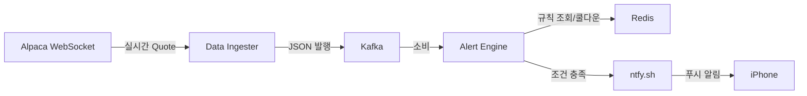
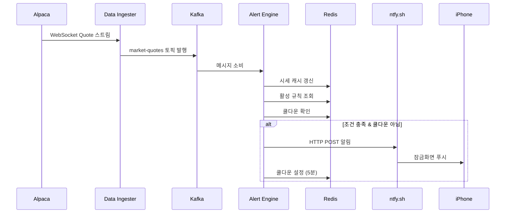

# Alpaca Real-time Stock Alert System

Alpaca Markets API를 통해 실시간 주식 시세를 수신하고, 사용자가 설정한 조건에 따라 iOS 푸시 알림을 발송하는 경량 스트리밍 파이프라인.

## 아키텍처



## 데이터 흐름



## 컴포넌트

| 컴포넌트 | 역할 | 메모리 제한 |
|----------|------|------------|
| Data Ingester | Alpaca WebSocket → Kafka 발행 | 512MB |
| Alert Engine | Kafka 소비 → 규칙 평가 → 알림 | 512MB |
| Kafka | 메시지 브로커 (1 파티션) | 512MB |
| Redis | 캐시 + 규칙 + 쿨다운 | 256MB |
| Zookeeper | Kafka 메타데이터 | 256MB |

## 설치 및 실행

### 1. 환경 설정

```bash
cp .env.example .env
# .env 파일에 Alpaca API 키와 ntfy 토픽 설정
```

### 2. 의존성 설치

```bash
python3 -m venv venv
source venv/bin/activate
pip install -r requirements.txt
```

### 3. 인프라 기동

```bash
docker-compose up -d
```

### 4. 서비스 실행

```bash
# 터미널 1: 데이터 수신 + Kafka 발행
python -m services.data_ingester.main

# 터미널 2: 알림 엔진
python -m services.alert_engine.main
```

## 환경변수 (.env)

| 변수 | 설명 | 기본값 |
|------|------|--------|
| `ALPACA_API_KEY` | Alpaca API 키 | - |
| `ALPACA_SECRET_KEY` | Alpaca Secret 키 | - |
| `WATCH_SYMBOLS` | 구독 종목 (쉼표 구분) | AAPL,TSLA,NVDA |
| `KAFKA_BOOTSTRAP_SERVERS` | Kafka 브로커 주소 | localhost:9092 |
| `REDIS_HOST` | Redis 호스트 | localhost |
| `REDIS_PORT` | Redis 포트 | 6379 |
| `NTFY_TOPIC_URL` | ntfy 토픽 URL | https://ntfy.sh/GirinDev |
| `NTFY_TITLE` | 알림 제목 | Stock Alert |

## 알림 규칙 설정

Alert Engine의 `main.py`에서 규칙을 등록한다:

```python
engine.add_rule({
    "rule_id": "rule-aapl-above-200",
    "symbol": "AAPL",
    "alert_type": "price_above",   # price_above | price_below | price_change
    "threshold": 200.0,
    "is_active": True,
})
```

Redis 연결 시 `rule_manager`를 통해 동적 CRUD 가능:

```python
from shared.rule_manager import create_rule, list_rules, remove_rule

create_rule("user1", "AAPL", "price_above", 200.0, "push")
```

## 알림 유형

| 유형 | 조건 | 우선순위 |
|------|------|---------|
| `price_above` | 현재가 ≥ 목표가 | 높음 (4) |
| `price_below` | 현재가 ≤ 하한가 | 높음 (4) |
| `price_change` | 변동률 ≥ 5% | 긴급 (5) |

## 리소스 최적화

- **WebSocket 전용**: HTTP 폴링 없음, 서버 푸시만 사용
- **단일 Kafka 브로커**: 토픽당 1 파티션, 복제 팩터 1
- **Redis 256MB**: LRU 정책으로 자동 메모리 관리
- **시장 시간 스케줄링**: 폐장 시 WebSocket 해제, CPU 1% 이하
- **로컬 버퍼**: Kafka 장애 시 1000건 임시 보관
- **쿨다운**: 동일 규칙 5분 내 중복 알림 억제

## 프로젝트 구조

```
alpaca_api/
├── docker-compose.yml          # Kafka + Redis 인프라
├── requirements.txt            # Python 의존성
├── .env                        # 환경변수 (gitignore)
├── shared/
│   ├── config.py               # 전역 설정
│   ├── models.py               # 데이터 모델 (Quote, AlertRule, AlertEvent)
│   ├── kafka_producer.py       # Kafka Producer + 로컬 버퍼
│   ├── redis_client.py         # Redis 캐시/쿨다운/규칙 저장
│   └── rule_manager.py         # Alert Rule CRUD
└── services/
    ├── data_ingester/
    │   ├── ingester.py         # Alpaca WebSocket 수신기
    │   ├── scheduler.py        # 시장 시간 스케줄러
    │   └── main.py             # 엔트리포인트
    ├── alert_engine/
    │   ├── engine.py           # 규칙 평가 엔진
    │   └── main.py             # 엔트리포인트
    └── notification/
        └── ntfy_sender.py      # ntfy 푸시 발송
```

## 기술 스택

- Python 3.11+ (asyncio)
- Apache Kafka (confluent-kafka)
- Redis 7 (redis-py)
- Alpaca Markets API (alpaca-py)
- ntfy.sh (iOS 푸시 알림)
- Docker Compose
