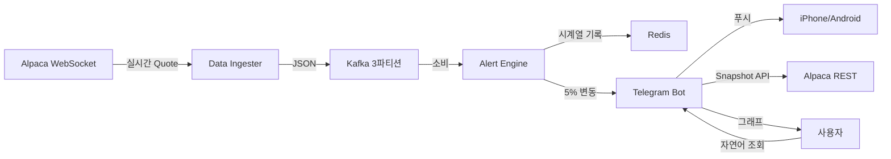
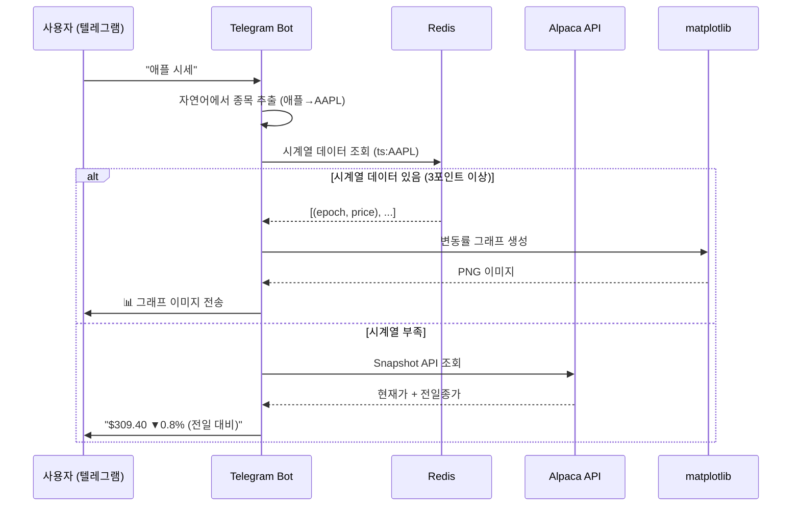
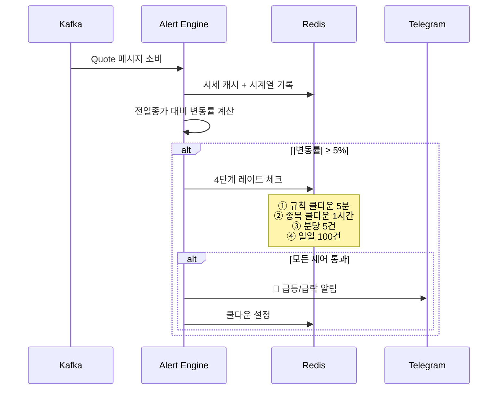

# Alpaca Real-time Stock Alert System

Alpaca Markets API로 나스닥 30종목 실시간 시세를 수신하고, 조건 충족 시 텔레그램 봇으로 알림을 발송하는 경량 스트리밍 파이프라인.

텔레그램으로 자연어 조회("애플 시세", "테슬라 얼마야") 및 3일 변동률 그래프 확인 가능.

## 아키텍처



## 텔레그램 봇 동작 과정



### 봇 명령어

| 입력 | 동작 |
|------|------|
| `/start` | chat 등록 (알림 수신 시작) |
| `/list` | 30종목 버튼 표시 → 클릭 시 3일 그래프 |
| `/price AAPL` | 특정 종목 시세 조회 |
| `애플 시세` | 자연어로 종목 조회 (한글/영문 모두 가능) |
| `테슬라 얼마야` | 자연어 조회 → 그래프 또는 가격 응답 |

### 자연어 인식 규칙

한글 이름이나 심볼이 메시지에 포함되면 자동 인식:
- "애플" → AAPL
- "테슬라" → TSLA
- "엔비디아" → NVDA
- "NVDA" → NVDA (대소문자 무관)

## 알림 발송 흐름



## 시계열 저장 구조

| 항목 | 값 |
|------|-----|
| Redis 키 | `ts:{SYMBOL}` (Sorted Set) |
| Score | Unix epoch (초) |
| Member | `"epoch:price"` |
| 보관 기간 | 3일 (자동 삭제) |
| 샘플링 | 분당 1포인트 (장중 실시간) |
| Backfill | Snapshot API로 전일종가/당일종가/최신호가 3포인트 |

## 빠른 시작

### 사전 요구사항

- Python 3.11+
- Docker & Docker Compose
- 텔레그램에서 `@alpaca_bbbbot` 검색 → `/start` 전송

### 설치 & 실행

```bash
# 환경 설정
python3 -m venv venv && source venv/bin/activate
pip install -r requirements.txt
cp .env.example .env  # API 키 입력

# 인프라 기동
docker-compose up -d

# 과거 데이터 적재 (최초 1회)
python scripts/backfill_timeseries.py

# 3개 프로세스 실행
python -m services.data_ingester.main   # 수집 + Kafka
python -m services.alert_engine.main    # 알림 판단
python -m services.telegram_bot.bot     # 봇 (조회 + 알림)
```

## 환경변수 (.env)

| 변수 | 설명 |
|------|------|
| `ALPACA_API_KEY` | Alpaca API 키 |
| `ALPACA_SECRET_KEY` | Alpaca Secret 키 |
| `WATCH_SYMBOLS` | 구독 종목 (비설정 시 300개) |
| `KAFKA_BOOTSTRAP_SERVERS` | Kafka 주소 |
| `REDIS_HOST` / `REDIS_PORT` | Redis 주소 |
| `TELEGRAM_BOT_TOKEN` | 텔레그램 봇 토큰 |

## 프로젝트 구조

```
alpaca_api/
├── docker-compose.yml              # Kafka + Redis
├── requirements.txt
├── scripts/
│   ├── sync-steering.sh            # playbook 동기화
│   └── backfill_timeseries.py      # 과거 시계열 적재
├── shared/
│   ├── config.py                   # 설정 + SSL 패치
│   ├── models.py                   # Quote 데이터 모델
│   ├── symbols.py                  # 나스닥 300종목 리스트
│   ├── symbol_names.py             # 한글 이름 매핑 + 자연어 검색
│   ├── kafka_producer.py           # Kafka Producer + 버퍼
│   ├── redis_client.py             # 캐시/쿨다운/레이트리밋/시계열
│   ├── rule_manager.py             # Alert Rule CRUD
│   └── db.py                       # SQLite (전일종가 + chat_id)
├── services/
│   ├── data_ingester/
│   │   ├── ingester.py             # Alpaca WebSocket 수신
│   │   ├── scheduler.py            # 시장 시간 스케줄러 (KST 표시)
│   │   └── main.py                 # 수집 엔트리포인트
│   ├── alert_engine/
│   │   ├── engine.py               # Kafka Consumer + 4단계 제어
│   │   └── main.py                 # 전일종가 기반 규칙 자동 등록
│   └── telegram_bot/
│       ├── bot.py                  # 명령어 + 자연어 + 버튼 핸들러
│       ├── notifier.py             # 텔레그램 알림 발송
│       └── chart.py                # matplotlib 3일 그래프 생성
└── vendor/
    └── harness-playbook/           # steering 지침 (git submodule)
```

## 기술 스택

| 구분 | 기술 |
|------|------|
| 언어 | Python 3.11+ |
| 메시지 브로커 | Kafka (confluent-kafka) |
| 캐시/상태 | Redis 7 |
| 시세 API | Alpaca Markets (IEX 피드) |
| 제어/알림 | Telegram Bot (python-telegram-bot) |
| 그래프 | matplotlib |
| 영속 저장 | SQLite |
| 컨테이너 | Docker Compose |
