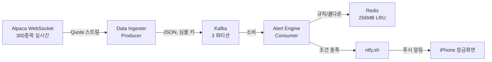
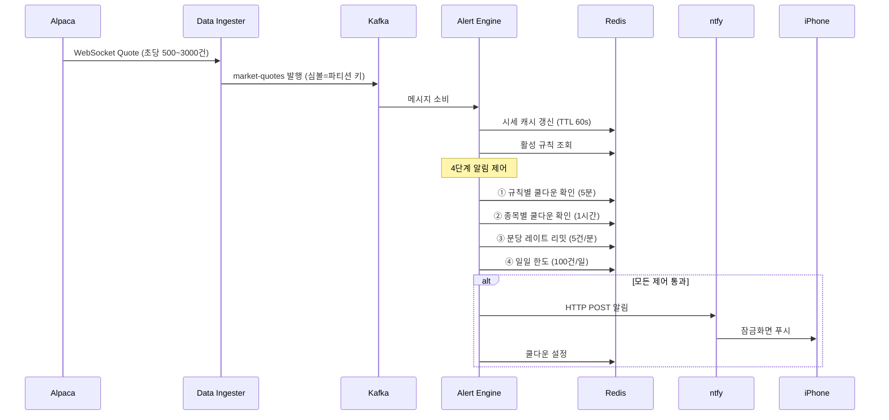

# Alpaca Real-time Stock Alert System

Alpaca Markets API를 통해 나스닥 300종목의 실시간 시세를 수신하고, 사용자가 설정한 조건에 따라 iPhone 푸시 알림(ntfy)을 발송하는 경량 스트리밍 파이프라인.

## 아키텍처



## 데이터 흐름



## 알림 빈도 제어

| 레이어 | 제어 대상 | 설정값 | Redis 키 | TTL |
|--------|----------|--------|----------|-----|
| 1 | 같은 규칙 | 5분 | `cooldown:{rule_id}` | 300초 |
| 2 | 같은 종목 | 1시간 | `cooldown:symbol:{AAPL}` | 3600초 |
| 3 | 전체 알림 | 5건/분 | `ratelimit:global` | 60초 |
| 4 | 일일 총량 | 100건/일 | `daily:{user}:{날짜}` | 자정까지 |

## 빠른 시작

### 사전 요구사항

- Python 3.11+
- Docker & Docker Compose
- iPhone에 [ntfy 앱](https://apps.apple.com/app/ntfy/id1625396347) 설치 후 `GirinDev` 토픽 구독

### 설치

```bash
# 1. 저장소 클론
git clone <repo-url>
cd alpaca_api

# 2. 가상환경 생성 및 의존성 설치
python3 -m venv venv
source venv/bin/activate
pip install -r requirements.txt

# 3. 환경변수 설정
cp .env.example .env
# .env 파일을 열어 Alpaca API 키 입력
```

### 실행

```bash
# 1. 인프라 기동 (Kafka + Redis)
docker-compose up -d

# 2. 데이터 수신 시작 (터미널 1)
python -m services.data_ingester.main

# 3. 알림 엔진 시작 (터미널 2)
python -m services.alert_engine.main
```

### 종료

```bash
# 서비스 종료 (각 터미널에서 Ctrl+C)

# 인프라 종료
docker-compose down
```

## 사용자 커맨드 정리

### 인프라 관리

| 커맨드 | 설명 |
|--------|------|
| `docker-compose up -d` | Kafka + Redis 백그라운드 기동 |
| `docker-compose down` | 인프라 종료 |
| `docker-compose ps` | 컨테이너 상태 확인 |
| `docker-compose logs kafka` | Kafka 로그 확인 |
| `docker-compose logs redis` | Redis 로그 확인 |

### 서비스 실행

| 커맨드 | 설명 |
|--------|------|
| `python -m services.data_ingester.main` | 데이터 수신 + Kafka 발행 시작 |
| `python -m services.alert_engine.main` | 알림 엔진 시작 (Kafka 소비 → 알림) |

### Kafka 토픽 확인

```bash
# 토픽 목록 조회
docker exec kafka kafka-topics --list --bootstrap-server localhost:9092

# market-quotes 토픽 메시지 확인 (실시간)
docker exec kafka kafka-console-consumer \
  --bootstrap-server localhost:9092 \
  --topic market-quotes \
  --from-beginning \
  --max-messages 5

# 토픽 상세 정보
docker exec kafka kafka-topics --describe \
  --topic market-quotes \
  --bootstrap-server localhost:9092
```

### Redis 상태 확인

```bash
# Redis CLI 접속
docker exec -it redis redis-cli

# 캐시된 시세 확인
GET quote:AAPL

# 쿨다운 상태 확인
EXISTS cooldown:symbol:AAPL
TTL cooldown:symbol:AAPL

# 오늘 알림 횟수 확인
GET daily:default:2026-05-31

# 분당 레이트 리밋 확인
GET ratelimit:global

# 등록된 규칙 확인
HGETALL rules:default

# 메모리 사용량 확인
INFO memory
```

### 알림 테스트

```bash
# ntfy 수동 테스트 (즉시 iPhone에 알림 도착)
curl -d "AAPL $300.00 목표가 도달!" \
  -H "Title: Stock Alert" \
  -H "Tags: chart_with_upwards_trend,moneybag" \
  -H "Priority: 4" \
  https://ntfy.sh/GirinDev
```

### 종목 관리

```bash
# 전체 300종목 구독 (기본값, .env에서 WATCH_SYMBOLS 비설정)
# 특정 종목만 테스트하려면 .env에 설정:
echo "WATCH_SYMBOLS=AAPL,TSLA,NVDA" >> .env
```

## 환경변수 (.env)

| 변수 | 설명 | 기본값 |
|------|------|--------|
| `ALPACA_API_KEY` | Alpaca API 키 | (필수) |
| `ALPACA_SECRET_KEY` | Alpaca Secret 키 | (필수) |
| `WATCH_SYMBOLS` | 구독 종목 (쉼표 구분, 비설정 시 300개 전체) | 300개 전체 |
| `KAFKA_BOOTSTRAP_SERVERS` | Kafka 브로커 주소 | localhost:9092 |
| `REDIS_HOST` | Redis 호스트 | localhost |
| `REDIS_PORT` | Redis 포트 | 6379 |
| `NTFY_TOPIC_URL` | ntfy 토픽 URL | https://ntfy.sh/GirinDev |
| `NTFY_TITLE` | 알림 제목 | Stock Alert |

## 알림 규칙 설정

`services/alert_engine/main.py`에서 규칙 등록:

```python
engine.add_rule({
    "rule_id": "rule-aapl-above-300",
    "symbol": "AAPL",
    "alert_type": "price_above",   # price_above | price_below | price_change
    "threshold": 300.0,
    "is_active": True,
})
```

Redis 연결 시 동적 CRUD:

```python
from shared.rule_manager import create_rule, list_rules, remove_rule, toggle_rule

# 규칙 생성
create_rule("user1", "AAPL", "price_above", 300.0, "push")

# 규칙 조회
rules = list_rules("user1")

# 규칙 삭제
remove_rule("user1", "rule-id-here")

# 규칙 비활성화
toggle_rule("user1", "rule-id-here", is_active=False)
```

## 알림 유형

| 유형 | 조건 | ntfy 우선순위 | 이모지 |
|------|------|-------------|--------|
| `price_above` | 현재가 ≥ 목표가 | 높음 (4) | 📈💰 |
| `price_below` | 현재가 ≤ 하한가 | 높음 (4) | 📉⚠️ |
| `price_change` | 변동률 ≥ 5% | 긴급 (5) | 🚨📈/📉 |

## 리소스 사용량

| 컴포넌트 | 메모리 | CPU (유휴) | CPU (활성) |
|----------|--------|-----------|-----------|
| Kafka | 512MB | ~1% | ~5% |
| Redis | 256MB | <1% | <1% |
| Zookeeper | 256MB | <1% | <1% |
| Data Ingester | ~50MB | <1% | ~3% |
| Alert Engine | ~50MB | <1% | ~2% |
| **합계** | **~1.1GB** | **~3%** | **~12%** |

## 프로젝트 구조

```
alpaca_api/
├── docker-compose.yml          # Kafka + Redis 인프라
├── requirements.txt            # Python 의존성
├── .env                        # 환경변수 (gitignore)
├── shared/
│   ├── config.py               # 전역 설정
│   ├── models.py               # 데이터 모델 (Quote, AlertRule, AlertEvent)
│   ├── symbols.py              # 나스닥 300종목 리스트
│   ├── kafka_producer.py       # Kafka Producer + 로컬 버퍼
│   ├── redis_client.py         # Redis 캐시/쿨다운/레이트리밋
│   └── rule_manager.py         # Alert Rule CRUD
└── services/
    ├── data_ingester/
    │   ├── ingester.py         # Alpaca WebSocket 수신기
    │   ├── scheduler.py        # 시장 시간 스케줄러
    │   └── main.py             # 엔트리포인트
    ├── alert_engine/
    │   ├── engine.py           # 규칙 평가 + 4단계 알림 제어
    │   └── main.py             # 엔트리포인트
    └── notification/
        └── ntfy_sender.py      # ntfy 푸시 발송
```

## 기술 스택

| 구분 | 기술 |
|------|------|
| 언어 | Python 3.11+ |
| 메시지 브로커 | Apache Kafka (confluent-kafka) |
| 캐시/상태 | Redis 7 (redis-py) |
| 시세 API | Alpaca Markets (alpaca-py, IEX 피드) |
| 푸시 알림 | ntfy.sh (HTTP POST) |
| 컨테이너 | Docker Compose v3.8 |

## 참고사항

- IEX 피드는 정규 거래시간(09:30~16:00 ET)에만 실시간 데이터 제공
- 폐장 후에는 마지막 호가가 유지됨 (장외 데이터는 SIP 피드 유료 구독 필요)
- ntfy 무료 플랜은 제한 없음 (셀프호스팅도 가능)
- 300종목 기준 맥북에서 컨슈머 1대 + 파티션 3개로 충분히 처리 가능
